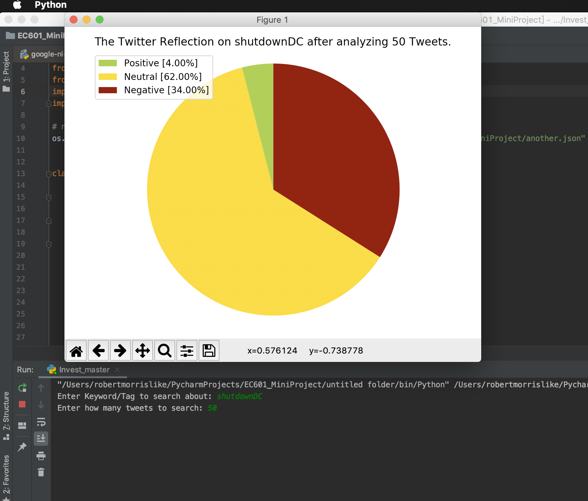
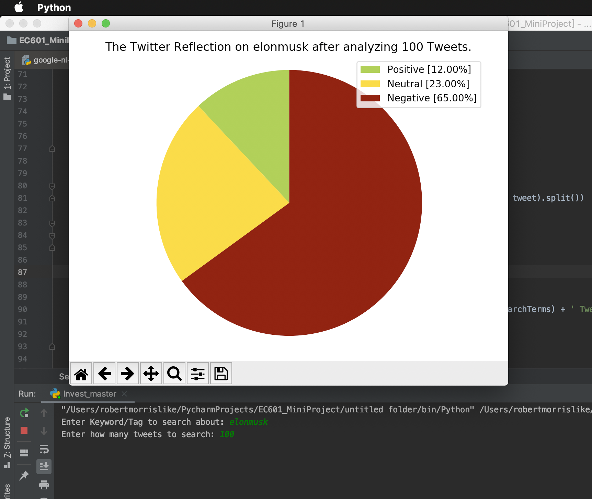

# EC601_twitter_keyword
an application that process tweets and generate keywords with google natural language api

# Product Mission

## Target Users

Investors who need to analyze newest decisions, movements and trends of the leaders of all industries such as technology, entertainment and even politics in order to assess the reflection on the market and further predict the price of stocks.

## User story

As a stock invester with a focus on American technology companies, I want to analyze tweets from president Trump, as well as top tech CEOs such as Elon Musk, to predict the stock tendency. If I can extract keywords and sentiments from a tweet, I can guess the situation of a company or industry, this tells me the potential future demand of a stock, which can help me make trade decisions.


## Minimum Valuable Product

As for MVP, user can enter a particular keyword and specify the number of tweets for the system to gather and then analyze.
In this way, user will get the sentiment feedback of gathered tweets about this keyword and a pie chart.

# System Design


System design is shown above.

From the user input we acquire the keyword and the number of tweets to be analyzed as parameters, then using twitter API and the developer account we access to the tweets. After teh data(tweets) preprocessed (format), then the contents of those tweets about the keyword is transmitted into Google natural language API which will provide us with the sentiment score of these tweets. The score between [-1,-0.25] is determined as "Negative" attitude, the score between [-0.25,0.25] is determined as "Neutral" attitude and score between [0.25,1] is determined as "Positive" attitude. By the result of the score we get the percentage of each kind of attitude on this keywords and therefore we have the feedback of those tweets sentiment.

# How to build our system

1. Gain Twitter developer consumer key and secret for API authentication
2. Gain Goole credential json file for API authentication
3. install python packages ```sh install_dependencies.sh```
4. run ```sh invest.sh``` to start the program

# Testing





By analyzing those twitter feedback we can predict the attitude of public and further decide the investment strategy.

# Lessons Learned

## What you liked doing?
  *Working for a part of a big project 
  *Teamwork with version control 
## What you could have done better?
We could have done more specific data analysis with the sentiment acquired, for example, getting relevant stock names accociated with a keyword, and show their stock tendencies based on the sentiment score.
## What you will avoid in the future?
  * We should avoid using python2 in the future, it will soon be no longer maintained by open source communities.
  * We should not forget to use .gitignore to skip tracking sensitive credential files. 

